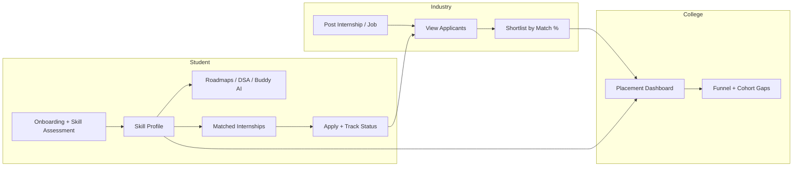
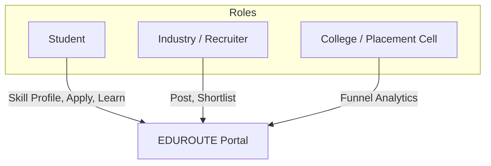
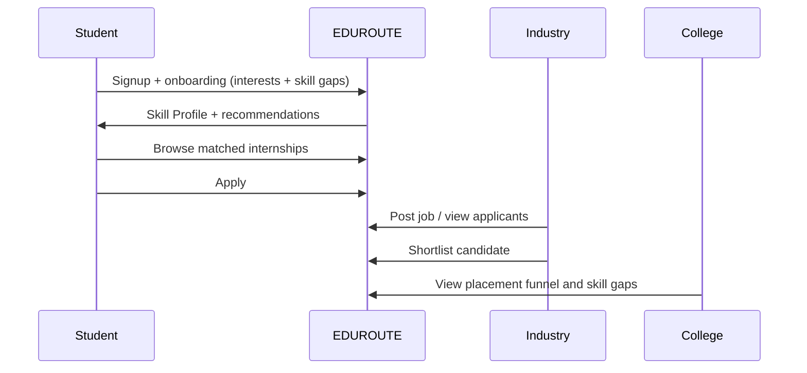
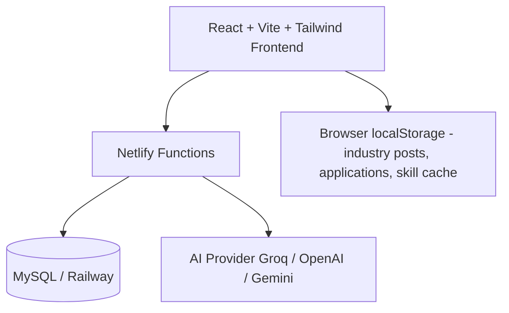

# EDUROUTE

### Academia–Industry Collaboration Portal for Skill Mapping, Internships & Placement

**Smart India Hackathon 2026 · Problem Statement SIH26044**  
*Portal for Academia – Industry collaboration for Skill Mapping, Internships and Placement*

[](https://www.sih.gov.in/)
[](https://sih.gov.in/sih2026PS)
[]()
[]()

**Live preview (PR):** https://deploy-preview-67--eduroutee.netlify.app

---

## 1. Problem we solve

There is a clear gap between **skills taught in colleges** and **skills expected by industry**.

| Stakeholder | Pain today |
|-------------|------------|
| **Students** | Unclear skill gaps, random internship applications, weak portfolios |
| **Industry** | Hard to find skill-matched candidates; noisy applications |
| **Colleges** | Low visibility into placement funnel and cohort skill gaps |

**EDUROUTE** is a unified portal that connects all three sides with skill assessment, mapping, matching, applications, and placement analytics.

---

## 2. Solution overview



---

## 3. Mapping to SIH26044

| SIH26044 requirement | EDUROUTE feature |
|----------------------|------------------|
| Skill assessment | Onboarding interest tracks + yes/no gap questions |
| Skill mapping | Skill Profile (scores, Good / Improve / Gap) + recommended next steps |
| Internship & job opportunities | Internships feed + Industry postings |
| Matching students ↔ openings | Match % on cards + “Recommended for you” |
| Application & tracking | Apply → Applied → Shortlisted → Interview → Hired |
| Industry collaboration | Industry workspace (`/industry`) |
| Institution visibility | College placement dashboard (`/college/placements`) |
| Learning support (value-add) | Roadmaps, DSA Sheet, Assessments, Buddy AI mentor |

---

## 4. Three-sided product



| Role | Key screens |
|------|-------------|
| **Student** | Dashboard, Skill Profile, Internships, My Applications, Roadmaps, DSA, Buddy AI |
| **Industry** | Post opening, applicant list, shortlist with match % |
| **College** | Placement counts, status funnel, cohort skill-gap snapshot |

---

## 5. Core user flow (demo path for jury)



**3-minute live demo order**

1. Student onboarding → **Skill Profile**  
2. **Internships** → Recommended + match % → **Apply**  
3. **My Applications** (status)  
4. **Industry** → post / shortlist  
5. **College placements** dashboard  

---

## 6. Feature map

```text
EDUROUTE
├── Student
│   ├── Auth + College ID verify (optional)
│   ├── AI onboarding (track + gap quiz)
│   ├── Skill Profile (scores, gaps, next steps)
│   ├── Dashboard (progress, applications shortcut)
│   ├── Internships (match %, recommended, apply)
│   ├── My Applications (status pipeline)
│   ├── Roadmaps / Pathways / Courses
│   ├── DSA Sheet (100 beginner problems)
│   ├── Assessments, Leaderboard, Rewards
│   └── Buddy AI + floating assistant
├── Industry
│   ├── Workspace login
│   ├── Post internship / job (skills, stipend, location)
│   └── Applicants + shortlist
└── College / Admin
    ├── Placement dashboard (funnel metrics)
    └── Admin panel (approvals, courses)
```

---

## 7. Architecture (high level)



| Layer | Stack |
|-------|--------|
| Frontend | React, TypeScript, Vite, Tailwind CSS, Framer Motion |
| Hosting | Netlify (static + serverless functions) |
| Auth / data | MySQL (Railway) via Netlify functions where configured |
| AI mentor | Buddy chat API + web-search fallback |
| Demo persistence | localStorage for industry posts, applications, DSA progress |

---

## 8. Tech stack

```text
Frontend     React 18 · TypeScript · Vite · Tailwind · Lucide
Routing      React Router
AI           Netlify Functions · Groq / OpenAI / Gemini adapters
Database     MySQL (Railway) for auth & buddy progress
Deploy       Netlify continuous deploy from GitHub
```

---

## 9. Project structure (simplified)

```text
eduroute_/
├── src/
│   ├── pages/
│   │   ├── Dashboard.tsx          # Student home
│   │   ├── SkillProfile.tsx       # Skill scores & gaps
│   │   ├── Career/Internships.tsx # Match % + apply
│   │   ├── Industry/              # Recruiter workspace
│   │   ├── Admin/PlacementDashboard.tsx
│   │   ├── Buddy/BuddyChat.tsx
│   │   ├── DSASheet.tsx
│   │   ├── Roadmaps/
│   │   └── Auth/
│   ├── utils/
│   │   ├── onboardingStore.ts
│   │   ├── industryStore.ts
│   │   └── internshipApplications.ts
│   └── components/
├── netlify/functions/             # Auth, buddy, proxies
└── package.json
```

---

## 10. Why this approach wins for SIH

| Jury lens | How EDUROUTE responds |
|-----------|------------------------|
| **Problem clarity** | Directly addresses academia–industry skill gap |
| **Completeness** | Student + Industry + College in one product |
| **Working demo** | Full apply → shortlist → placement path |
| **Innovation** | Skill gap onboarding + match scoring + AI mentor |
| **Feasibility** | Built on standard web stack; deployable today |
| **Impact** | Employability, internship quality, college visibility |

---

## 11. Future scope

- NSQF / NOS formal competency taxonomy  
- Faculty FDP & industrial training modules  
- Server-synced applications (shared live DB for all roles)  
- Verifiable digital credentials on portfolio  
- Deeper adaptive skill assessments  

---

## 12. Quick start (developers)

```bash
git clone https://github.com/laxmikhandelwal690-svg/eduroute_.git
cd eduroute_
npm install
npm run dev
```

Configure Netlify env (when using cloud auth / Buddy):

- `MYSQL_URL` or Railway MySQL vars  
- `JWT_SECRET`  
- `GROQ_API_KEY` / `OPENAI_API_KEY` / `GEMINI_API_KEY` (optional)

---

## 13. Team note

Built as a **software** solution for **SIH26044**, focused on a usable three-sided portal rather than a single student learning app.

**EDUROUTE — Learn · Map skills · Match · Get hired**
